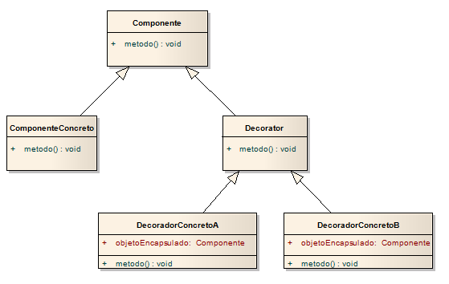

# El Patrón Decorador

## Gurú y alumno...
- **Gurú**: Ha pasado algún tiempo desde nuestra última reunión. ¿Has estado meditando profundamente sobre la herencia?
- **Alumno**: Sí, Gurú. Si bien la herencia es poderosa, he aprendido que no siempre conduce a los diseños más flexibles o fáciles de mantener.
- **Gurú**: Ah, sí, has progresado. Dime, alumno, ¿cómo lograrás la reutilización si no es mediante la herencia?
- **Alumno**: Gurú, he aprendido que existen maneras de heredar el comportamiento en tiempo de ejecución mediante **la composición y la delegación**.
- **Gurú**: Continúa...
- **Alumno**: Cuando heredo el comportamiento mediante la creación de subclases, ese comportamiento se establece estáticamente en tiempo de compilación. Además, todas las subclases deben heredar el mismo comportamiento. Sin embargo, si puedo extender el comportamiento de un objeto mediante la composición, puedo hacerlo dinámicamente en tiempo de ejecución.
- **Gurú**: Muy bien; estás empezando a comprender el poder de la composición.
- **Alumno**: Sí, puedo añadir múltiples responsabilidades nuevas a los objetos mediante esta técnica, incluyendo responsabilidades que ni siquiera había previsto el diseñador de la superclase. ¡Y no tengo que tocar su código!
- **Gurú**: ¿Qué has aprendido sobre el efecto de la composición en el mantenimiento de tu código?
- **Alumno**: Bueno, a eso me refería. Al componer objetos dinámicamente, puedo añadir nuevas funcionalidades escribiendo código nuevo en lugar de modificar el código existente. Como no modifico el código existente, las posibilidades de introducir errores o causar efectos secundarios no deseados en el código preexistente se reducen considerablemente.
- **Gurú**: Muy bien. Suficiente por hoy. Me gustaría que reflexionaras más sobre este tema... Recuerda, el código debe estar cerrado (a los cambios) como la flor de loto al atardecer, pero abierto (a la extensión) como la flor de loto por la mañana.

# El Principio Open-Close:
** Las clases deben estar abiertas para su extensión, pero cerradas para su modificación.**

Nuestro objetivo es permitir que las clases se extiendan fácilmente para incorporar nuevas funcionalidades sin modificar el código existente.  
¿Qué obtenemos al lograrlo? Diseños resistentes al cambio y lo suficientemente flexibles como para incorporar nuevas funcionalidades y satisfacer las necesidades cambiantes.

¿Abierto a extensiones y cerrado a modificaciones? Eso suena muy contradictorio.   
** Pregunta**: ¿Cómo puede un diseño ser ambas cosas?   
**Respuesta**: Resulta que existen algunas técnicas ingeniosas de POO que permiten extender los sistemas, incluso sin modificar el código subyacente. Pensemos en el patrón Observer, al añadir nuevos observadores, podemos extender el sujeto en cualquier momento sin necesidad de añadir código. 

De acuerdo, se entiende el patrón Observer, pero 
** Pregunta**: ¿cómo se diseña algo que sea extensible pero a la vez cerrado a modificaciones?  
R: Muchos patrones nos ofrecen diseños probados que protegen el código de modificaciones, al proporcionar un mecanismo de extensión.

Lograr que el diseño orientado a objetos sea flexible y extensible sin modificar el código existente requiere tiempo y esfuerzo. En general, no podemos darnos el lujo de definir con precisión cada parte de nuestros diseños (y probablemente sería un desperdicio). Seguir el principio de Abierto-Cerrado suele introducir nuevos niveles de abstracción, lo que añade complejidad a nuestro código. Lo ideal es concentrarse en las áreas que tienen más probabilidades de cambiar en los diseños y aplicar los principios allí.

Aunque pueda parecer una contradicción, existen técnicas que permiten extender el código sin modificarlo directamente.
Hay que tener cuidado al elegir las áreas de código que necesitan extenderse; aplicar el Principio Abierto-Cerrado en todas partes es ineficiente e innecesario, y puede dar lugar a un código complejo y difícil de entender.

# Presentamos el patrón Decorador

Bien, hemos visto que representar nuestras Infusiones y Condimentos con herencia no ha funcionado muy bien: obtenemos explosion de clases y diseños rígidos, o añadimos funcionalidad a la clase base que no es apropiada para algunas de las subclases.

Así que, en su lugar, haremos lo siguiente: comenzaremos con una bebida y la "decoraremos" con los condimentos en tiempo de ejecución.  
Por ejemplo, si el cliente quiere un Café De la casa con Crema y Chocolate, haremos lo siguiente:
1. Comenzaremos con un objeto Café de la casa.
2. Lo decoraremos con un objeto Crema.
3. Lo decoraremos con un objeto Chocolate rallado.
4. Llamaremos al método Costo() y utilizaremos la delegación para sumar el costo de los condimentos.

Pero, ¿cómo se "decora" un objeto y cómo entra en juego la delegación?
Una pista: piensa en los objetos decoradores como "envoltorios". 

Veamos cómo funciona esto.
#### 1 Comenzaremos con un objeto Café de la casa
Recordemos que DeLaCasa hereda de Infusion y tiene el método **Costo()** que nos dice cuanto cuesta la infusión.
#### 2 El cliente quiere Crema 
Creamos un objeto decorador Crema y envolvemos con él, el DeLaCasa.
El objeto Crema es del tipo Condimento que hereda también de Infusion.
Así que Crema tiene también un método **Costo()** al igual que el objeto que está decorando y
mediante polimorfismo podemos tratarlo cualquier Infusion.
#### 3 El cliente quiere Chocolate Rallado
Se repite lo anterior reemplazando Crema por Chocolate Rallado.
#### 4 Computar Costo
Ahora es el momento de calcular el costo para el cliente. Para ello,
llamamos al método **Costo()** del decorador más externo, **Chocolate Rallado**, y este se encargará de
delegar el cálculo del costo a los objetos que decora. Y así sucesivamente.  

**Veamos cómo funciona:**
1. Llamamos Costo() del condimento ChocolateRallado
2. Chocolate Rallado llama a Costo() de Crema
3. Crema llama a Costo() de DeLaCasa
4. DeLaCasa retorne su costo (CostoBase)
5. Crema suma su CostoBase al resultado del costo de DeLaCasa recibido.
6. Chocolate Rallado suma su CostoBase al resultado de costo de Crema (con DeLaCasa) recibido.
7. El costo calculado es la suma de todos los costos.

### Esto es lo que sabemos sobre los decoradores hasta ahora
- Los decoradores tienen el mismo supertipo que los objetos que decoran.
- Se puede usar uno o más decoradores para envolver un objeto.
- Dado que el decorador tiene el mismo supertipo que el objeto que decora, podemos
pasar un objeto decorado en lugar del objeto original (envuelto).
- El decorador añade su propio comportamiento antes y/o después de delegar en el objeto que
decora el resto del trabajo.
- Los objetos se pueden decorar en cualquier momento, por lo que podemos decorarlos dinámicamente en
tiempo de ejecución con tantos decoradores como queramos.

# El patrón Decorador definido
El patrón Decorador añade responsabilidades adicionales a un objeto de forma dinámica.
Los decoradores ofrecen una alternativa flexible a la herencia para extender la funcionalidad.

  

# Desafío:

Como armarías el ticket de una infusión para que liste el detalle de costo de cada
infusión y sus condimentos, si los hay?
